# Octopus Case Study

A mini e-commerce application built with Next.js, TypeScript, and Tailwind CSS as part of a frontend case study. The app includes user authentication, a product listing page with filtering and pagination, and a product detail page with reviews and a fully functional shopping cart.

---

## Live Demo

**[https://octopus-case-study.vercel.app](https://octopus-case-study.vercel.app)**

> Test credentials: **username:** `emilys` / **password:** `emilyspass`

---

## Screenshots

### Desktop

<table>
  <tr>
    <td align="center"><b>Login</b></td>
    <td align="center"><b>Products</b></td>
    <td align="center"><b>Product Detail</b></td>
  </tr>
  <tr>
    <td>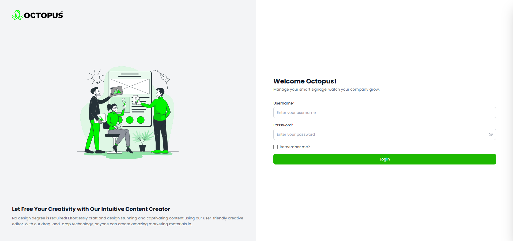</td>
    <td>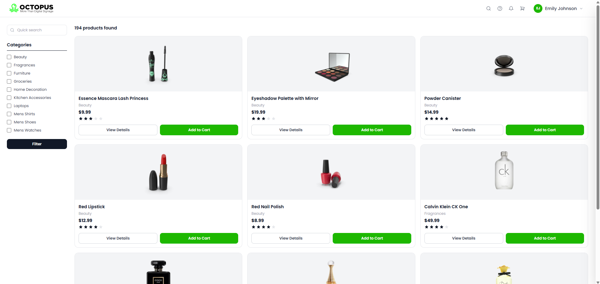</td>
    <td>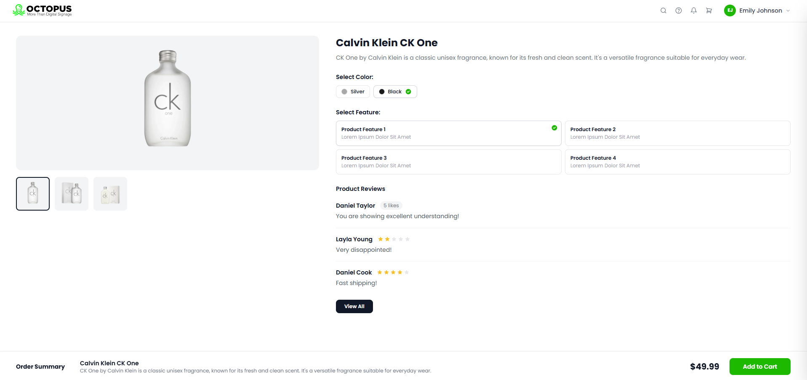</td>
  </tr>
</table>

### Cart, Dark Mode & Variants

<table>
  <tr>
    <td align="center"><b>Cart Drawer</b></td>
    <td align="center"><b>Dark Mode</b></td>
    <td align="center"><b>Add to Cart Modal</b></td>
    <td align="center"><b>Cart Variants</b></td>
  </tr>
  <tr>
    <td>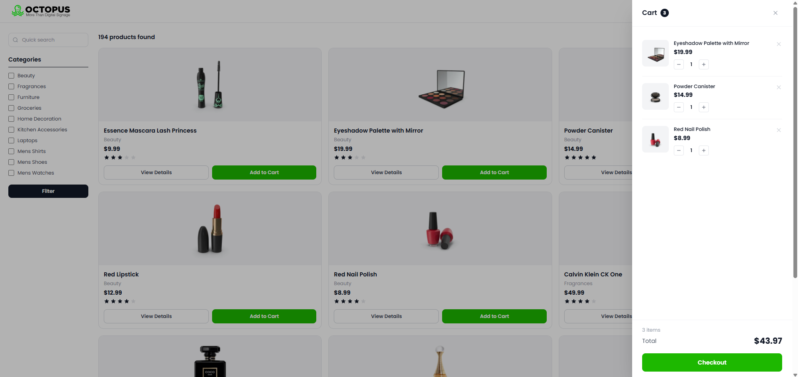</td>
    <td>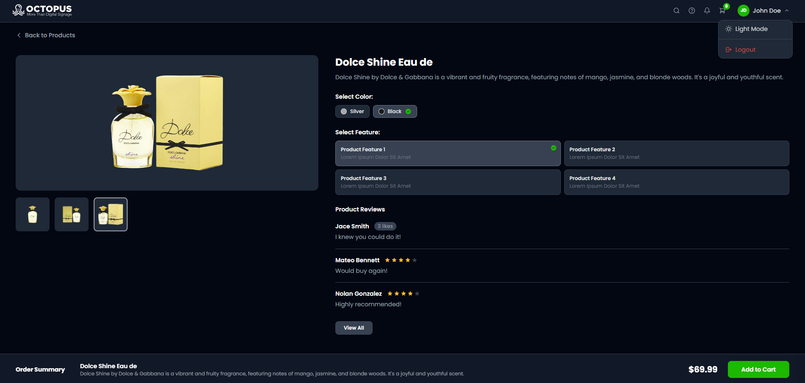</td>
    <td>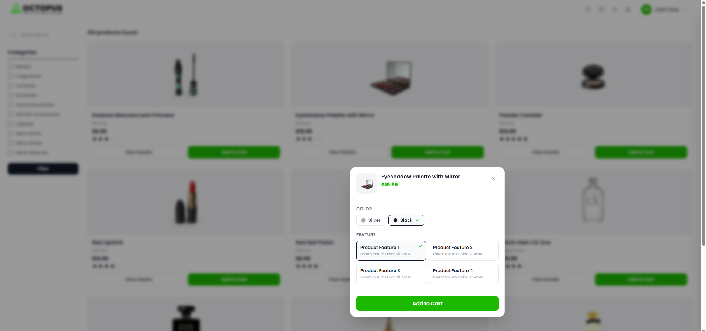</td>
    <td>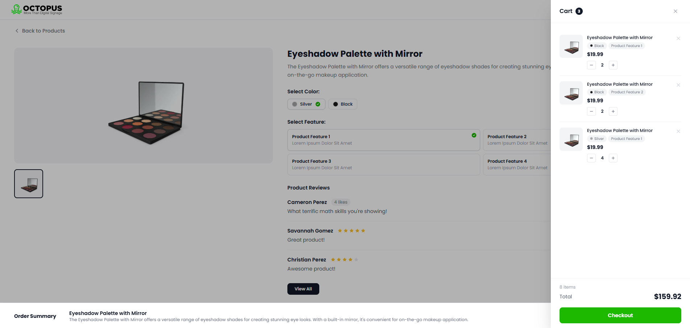</td>
  </tr>
</table>

### Mobile

<table>
  <tr>
    <td align="center"><b>Login</b></td>
    <td align="center"><b>Products</b></td>
    <td align="center"><b>Product Detail</b></td>
    <td align="center"><b>Cart</b></td>
  </tr>
  <tr>
    <td>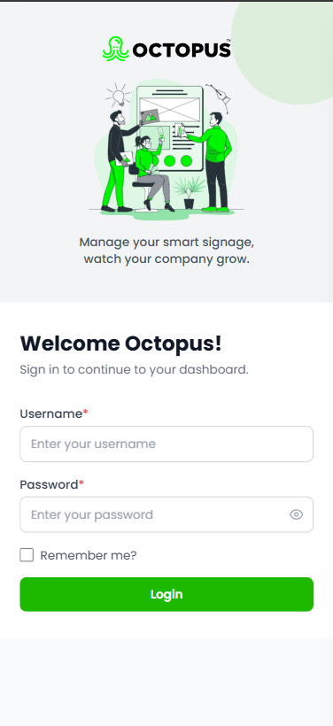</td>
    <td>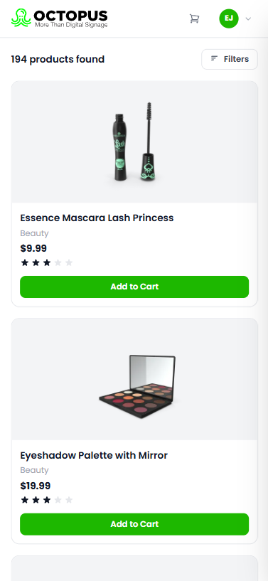</td>
    <td>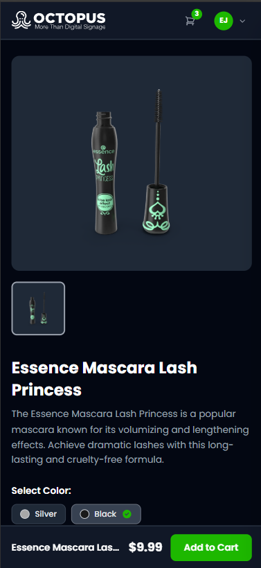</td>
    <td>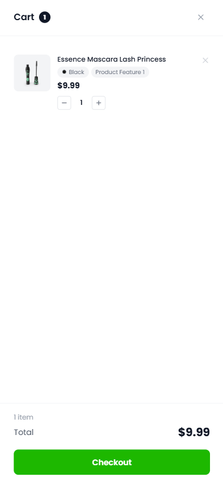</td>
  </tr>
</table>

---

## Getting Started

### Prerequisites

- Node.js 18+
- npm

### Installation

```bash
npm install
```

### Development

```bash
npm run dev
```

The app runs at [http://localhost:3000](http://localhost:3000) and redirects to `/login`.

### Production Build

```bash
npm run build
npm start
```

---

## Pages

| Route | Description |
|---|---|
| `/login` | Authentication page |
| `/products` | Product listing with filters and pagination |
| `/products/[id]` | Product detail with reviews and cart |

---

## Tech Stack

| Technology | Version | Why |
|---|---|---|
| **Next.js** | 14 (App Router) | File-based routing, server components, ISR for product pages |
| **TypeScript** | 5 | Type safety across components, contexts, and API responses |
| **Tailwind CSS** | 3 | Utility-first styling, dark mode via `class` strategy |
| **next-themes** | latest | Flicker-free dark mode with localStorage persistence |

---

## Architecture

### Folder Structure

```
app/
  layout.tsx          # Root layout — wraps ThemeProvider, AuthProvider, CartProvider
  page.tsx            # Redirects / → /login
  login/page.tsx
  products/
    page.tsx
    [id]/page.tsx     # Server component — fetches single product (reviews from product payload)
components/
  auth/LoginForm.tsx
  layout/Header.tsx
  products/
    ProductList.tsx   # Client component — search, filter, pagination state
    ProductCard.tsx
    ProductDetail.tsx
  ui/
    StarRating.tsx
    Pagination.tsx
    CartDrawer.tsx      # Slide-in cart panel with checkout animation
    AddToCartModal.tsx  # Color & feature selection modal (triggered from product listing)
  providers/
    ThemeProvider.tsx
contexts/
  AuthContext.tsx     # Auth state, login/logout, automatic token refresh
  CartContext.tsx     # Cart state, variant-aware deduplication, DummyJSON sync
lib/
  productOptions.ts   # Shared color & feature constants
```

### State Management

**AuthContext** manages the full authentication lifecycle:
- Persists session to `localStorage` (Remember Me) or `sessionStorage` (tab-only)
- Automatically refreshes the JWT access token every 25 minutes via `POST /auth/refresh`, before the 30-minute expiry
- Forces logout if refresh fails

**CartContext** manages the shopping cart:
- Fetches the user's existing cart from `GET /carts/user/{id}` on login
- Each cart item is identified by a **composite key** (`id|color|feature`), so the same product added with different options appears as a separate line item rather than incrementing a shared counter
- Applies **optimistic updates** — UI updates immediately, then syncs with `PUT /carts/{id}` (merge) or `POST /carts/add`
- `clearCart` is called on checkout, triggering the order success animation

### Route Protection

`middleware.ts` at the project root enforces authentication on all `/products` routes. Unauthenticated requests are redirected to `/login`. Authenticated users visiting `/login` are redirected to `/products`.

### API Integration

| Endpoint | Usage |
|---|---|
| `POST /auth/login` | User authentication |
| `POST /auth/refresh` | Silent token renewal |
| `GET /products` | Paginated product listing |
| `GET /products/search` | Search by keyword |
| `GET /products/category/:slug` | Category filter |
| `GET /products/:id` | Product detail (includes `reviews` used for comments) |
| `GET /comments/:id` | Product comments *(currently disabled; using `product.reviews` only until clarified)* |
| `GET /carts/user/:id` | Load existing cart on login |
| `POST /carts/add` | Create new cart |
| `PUT /carts/:id` | Update cart (merge: true) |

---

## Features

- **Authentication** — Login with error handling, Remember Me toggle (localStorage vs sessionStorage), automatic JWT refresh, forced logout on token expiry
- **Product Listing** — 9 products per page, category checkbox filter, keyword search, pagination with ellipsis
- **Product Detail** — Image gallery with thumbnail navigation, color/feature selection, reviews from the product payload (`product.reviews`), sticky order summary bar, back navigation button
- **Add to Cart Modal** — Clicking "Add to Cart" on the product listing opens a focused modal for selecting color and feature before adding, ensuring consistent variant data regardless of entry point
- **Cart Variants** — The same product added with different color/feature combinations appears as separate line items in the cart, each showing its selected options as pill badges. The product card badge on the listing page aggregates all variants of that product into a single count
- **Shopping Cart** — Slide-in drawer, quantity stepper, remove item, real-time total, selected color/feature displayed per item, checkout with SVG stroke-draw success animation
- **Animations** — Staggered product card entrance, hover lift + image zoom on cards, shimmer skeleton loading, image gallery fade transition, "Added!" button feedback, cart badge pop on item add, dropdown scale-in, login panel slide-in with form element stagger
- **Dark Mode** — System-independent toggle in the profile dropdown, persisted via `next-themes`
- **Responsive** — Mobile-first layout, collapsible sidebar filter on mobile, full-width cart drawer on small screens
- **Loading States** — Shimmer skeleton grid while products load, mimicking the real card layout
- **Error Handling** — Inline error messages on login failure, retry button on product fetch failure, `notFound()` for invalid product IDs
